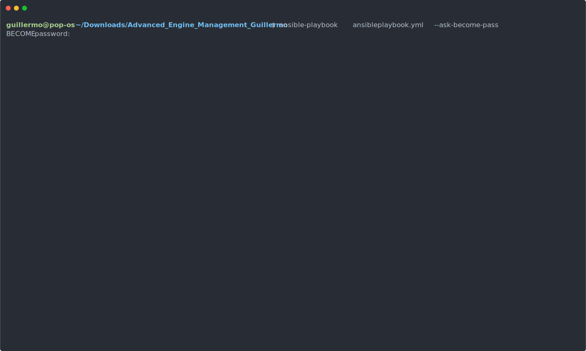

# Advanced Engine Management Guillermo


Provisioning software, configuring and deploying applications using Ansible.

---

<p align="center">
  
</p>

---

```

sudo apt install git -y
sudo apt install ansible -y

git clone https://github.com/gllrmzndm/Advanced_Engine_Management_Guillermo.git

cd Advanced_Engine_Management_Guillermo

ansible-playbook  ansibleplaybook.yml --ask-become-pass

```

---